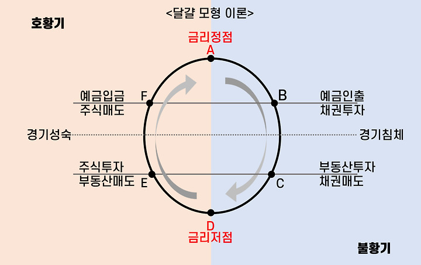

# 20250118

## 국제유가의 지수를 흔드는 놈들

1. WTI (서부 택사스)
2. 두바이유
3. 브렌트유

## 매출 손익계산서 주요 지표

- 매출액
- 매출이익
- 영업이익
- 당기순이익
- 영업이익률
- 당기순이익률

## 자산 = 부채 + 자본

- 매출액 : RAW
- 매출원가 : 재료비, 투여 자원의 가치
- 매출 총 이익
- 판관비 : R&D, 마케팅, 프로모션, 재료비, 
- 영업이익 : 
- 금융비용
- EBITDA
- 법인세 : 영업 이익 기준으로 내는 세금
- 당기순이익

## 매출 -> 손익계산서

- **매출이익** = 매출액 - 매출원가
- 매출이익률 = 매출이익 / 매출액
- 매출원가 = 매출액 - 매출이익
- 매출원가 비율 = 매출원가 / 매출액
- 판매비와 관리비 = 매출액 - 매출이익
- 판매비와 관리비 비율 = 판매비와 관리비 / 매출액
- **영업이익** = 매출이익 - 판매비와 관리비
- 영업이익률 = 영업이익 / 매출액
- 영업이익 비율 = 영업이익 / 매출액
- 금융비용 (임대료, 대출이자 등)
- 법인세 차감전 순이익 (EBITDA)
- 법인세
- **당기순이익**
- 당기순이익률 = 당기순이익 / 매출액
- 당기순이익 비율 = 당기순이익 / 매출액

### 당기 순이익

- 회사에서 정말로 남긴 이익
- 주주에게 환원 될 수 있는 금액

## 사업자

- 개인사업자
- 법인사업자

## 보고서 

- 1분기 : 1월 ~ 3월 (분기 보고서)
- 2분기 : 4월 ~ 6월 (분기 보고서)
- 3분기 : 7월 ~ 9월 (분기 보고서)
- 4분기 : 1월 ~ 12월 (연간 보고서)
- DART 통해서 볼 수 있음

## 

- 자산 = 부채 + 자본
- 자산
  - 유동 자산
  - 비유동 자산
- 부채
  - 유동 부채
  - 비유동 부채
- 자본
  - 자본금
    - 우선주자본금
    - 보통주자본금
  - 이익잉여금
    - 배당 주고 회사에 남긴 돈
  - 자본총계
  - 자본이 늘어난다는 것
  - 자본잠식이 났다는 것

## 경제 공부의 끝

- 세금과 절세

## 자산 = 부채 + 자본 -> 국가에도 반영된다.

- 경기 침체가 일어나면 정부는 경기 부양을 위해 노력함
- 경기 침체 -> 투자하기 제일 좋은 시기
- **인플레이션은 반드시 온다** -> 종교처럼 믿어야 함.

## 일본 -> 잃어버린 30년

- 미국 -> sony, toyota, panasonic등으로 인해 손해가 발생
- 경상수지 / 무역적자 
- 미국 -> 1985 플라자 합의
- 뉴욕 플라자 호텔 미일독영프 엔화가치를 2배로 올림
- 일본의 자산가치 폭등 -> 가격에 버블이 생김
- 일본 자산가치 폭락 -> 일본 경제 침체
- 아베노믹스
  - 경기부양을 유도했으나 실패
    - 통화정책 (양적완화)
    - 정부재정정책 
    - 규제 없애기
    - 실적 없이 주가만 오르고 있음
  - 유동성 함정 -> 내수가 살아나지 않음

## 미국의 금융공격

- 미국에게 무역 적자를 안겨주는 나라.
  

1. 환율 조작국 (실물경제 공격)
  - 미국의 환율공격으로 망할 수 있음. (잃어버린 30년)
  - 미국이 우방으로 바지 않는 순간 당할 수 있음.
2. 양털깎기 (금융경제 공격)
  - 월스트리트의 투자로 몸집을 키움
  - 커버린 몸집을 깎아서 다시 털어옴

- 중국
  - 계획 경제
  - 환율 조작 -> 내수경제가 강해서 미국의 공격 무력화
  - 양털깎기 -> 국가가 자본을 통제로 불가능...
  - 미중간 무역 갈등, 관세 전쟁 중
    - 오바마 행정부 부터 시작
    - 트럼프 (MAGA, Make America Great Again)
      1. 관세 정책
      2. 감세 정책
      3. 이민자 정책
      4. 가상자산 정책

## 트럼프와 미국 경제

MAGA, Make America Great Again
- 미국에 투자 해야하냐 마냐 혼란을 가져옴.
- 

1. 관세 정책
  - 다른 나라의 제조품을 미국에서 팔지 않도록, 
  - 미국에 인플레이션을 가져오는 정책이 됨..
  - 단기적으로은 인플레지만 장기적으로는..?
2. 감세 정책
  - 법인세, 기업의 미국에 투자하는 것을 장려
  - 수요견인 인플레이션의 결과를 가져옴
3. 이민자 정책
  - 자국 제조업에 투자, 일자리 창출을 목표하고 있음
  - 비용 인플레이션의 결과를 가져옴
  - 직장을 얻은 미국놈들이 세금을 내면서 제원이 충당됨, 장기적으로 이득
4. 가상자산 정책
  - 전략 자산화
  - 정부가 사들임
  - 가상 자산의 가치가 올라가면, 부채를 추가적으로 끌어올 수 있음.
  - 제롬 파월이 강력하게 반대하는 중.
  - CBDC (Central Bank Digital Currency)
    - 중앙은행이 발행하는 가상 화폐
    - 미국의 경우 미국 달러를 발행하는 것
    - 스테이블 코인
      - 미국 달러와 1:1 대응
      - 세계에서 도전중
      - 한국에서 앞선다고 평가중...

## 주조차익 (세뇨리지 효과)

- 현금을 찍어서 만들어내는 이익
- 미국 -> 달러를 찍어내면 자본금이 늘어나게 됨
- 달러의 가치가 높기 때문에 가능한 것

## 기축통화의 중요성

국가 부채 비율 G20 OECD 평균을 봤을 때, 망한 나라 제외하고 다 기축통화를 직접 찍는 나라임.

## 개인투자

- 부자가 되는 방법
  1. 자산형성
    - 현금 흐름을 만드는 좋은 자산을 만드는 것
  2. 현금흐름
    - 경제적 자유를 위해서는 현금 흐름이 있어야 함.
    - 이자소득, 주식 이익, 주식 배당, 주식 이익 등 소득
    - 소득 - 지출 = X > 0
    - X

### 경제적 자유(Economic Freedom)

경제적 자유는 개인, 기업, 국가가 경제활동을 자유롭게 영위할 수 있는 정도를 의미합니다. 즉, 재산권 보호, 자유로운 교역, 규제 및 과세 수준 등이 개인과 기업의 경제적 선택을 제약하지 않는 상태를 가리킵니다. 일반적으로 정부 개입이 최소화되고, 시장 원리에 따라 자원과 재화가 분배되는 환경을 추구합니다.

#### 1. 경제적 자유의 핵심 요소

1.	재산권 보호
  - 개인이나 기업이 합법적으로 획득한 자산을 안전하게 소유·관리·이용할 수 있는 권리.
  - 재산권이 확고하게 보장될수록 투자와 창업 활동이 활성화됩니다.
2.	자유로운 교역과 경쟁
  - 무역 장벽(관세, 비관세 장벽)이 낮고, 국내외 기업이 공정하게 경쟁할 수 있는 환경.
  - 효율적인 경쟁은 혁신과 생산성 향상을 유도하고 소비자 선택권을 넓혀줍니다.
3.	규제 및 세금 정책
  - 과도한 규제나 높은 세금 부담은 경제 주체의 의사 결정을 제약할 수 있음.
  - 경제적 자유가 높은 국가일수록 규제는 필요 최소한으로 유지되고, 조세 제도가 간편하고 투명합니다.
4.	통화 안정성과 금융 자유
  - 물가 안정, 자금의 자유로운 이동(자본 이동 자유), 금융기관의 건전성 등이 포함됩니다.
  - 안정적인 통화 제도와 금융 환경이 경제 주체에게 예측 가능성과 신뢰를 제공합니다.

#### 2. 경제적 자유의 장단점

1.	장점
  - 시장 효율성 향상: 시장 원리에 따라 자원이 효율적으로 배분될 가능성이 높음.
  - 혁신 촉진: 기업이 규제 부담 없이 경쟁하고 투자할 수 있어 기술 발전과 혁신이 가속화.
  - 개인 권리 존중: 개인이 자신의 재산과 선택에 대해 자율적인 권리를 행사할 수 있음.
2.	단점
  - 불평등 심화 가능: 시장 경쟁에서 승자가 독점적 지위를 누리는 등 소득·자산 격차가 확대될 수 있음.
  - 시장 실패: 공공재 공급, 외부효과, 정보 비대칭 등으로 인해 시장만으로는 해결하기 어려운 문제가 존재.
  - 사회 안전망 부족: 정부 개입이 최소화되다 보니 의료, 교육, 복지 측면에서 취약 계층이 소외될 위험이 있음.

#### 3. 경제적 자유 지표

세계 여러 연구 기관이 각국의 경제적 자유도를 평가합니다. 대표적인 예로:

1.	프레이저 연구소(Fraser Institute)의 경제적 자유 지수
  - 재산권 보호, 정부 규제, 금융 자유, 무역 자유 등 세부 항목을 평가.
2.	헤리티지 재단(Heritage Foundation)의 경제자유지수(Index of Economic Freedom)
  - 재정 건전성, 정부 규모, 규제 효율성, 시장 개방성 등 항목을 점수화하여 국가별 순위를 매김.

이러한 지표를 바탕으로 국가 간 시장 친화적 환경, 정부 규제 수준, 투자 자유도 등을 비교할 수 있습니다.

#### 4. 경제적 자유와 발전의 관계

1.	경제 성장
  - 대체로 경제적 자유가 높은 국가가 더 빠른 성장세를 보인다는 연구 결과가 많음.
  - 이유: 외국인 투자 유치, 혁신, 효율적인 시장 작동 등.
2.	복지 및 분배
  - 경제적 자유가 높아지면 경쟁이 치열해지고, 시장 원리에 따라 소득 격차가 벌어질 수도 있음.
  - 이를 보완하기 위한 사회 안전망과 소득 재분배 정책이 필요하다는 주장도 있음.
3.	투자 환경
  - 경제적 자유가 높을수록 외국인 직접 투자(FDI) 유입이 늘어나고, 글로벌 기업 활동이 활발해짐.

#### 5. 결론

경제적 자유는 개인과 기업이 자율적으로 경제활동을 전개할 수 있도록 장려하는 개념이며, 자유로운 시장 경쟁, 재산권 보호, 규제 완화, 무역 개방성 등을 핵심으로 합니다. 이를 통해 시장 효율성, 혁신, 투자를 촉진할 수 있지만, 동시에 사회 안전망이 취약해지고 소득 불평등이 커질 수 있다는 단점도 존재합니다. 따라서 각국은 경제적 자유와 공공정책 간의 균형점을 찾는 과정에서 다양한 제도적 실험과 보완책을 마련하고 있습니다.

### 종합소득세

1. 근로소득
  - 급여
2. 사업소득
3. 연금소득
  - 공적연금
    - 국민연금등 국가가 하는
  - 사적연금
    - 보험등 개인적으로 가입하는
4. 이자소득
  - 예/적금, 채권 등
5. 배당소득
  - 주식 배당
6. 기타소득
  - 복권, 포상 등 1회성 소득

일반적인 사람은 **연금, 이자, 배당** 소득에 집중하는 것이 좋음.  
주식으로 돈 버는 시기는 경제 호황시기 뿐임. 각 시기별로 사야하는 자산의 종류가 다름. Nothing is forever.

### 달걀 모형 **이론**



달걀 모형(계란형) 이론은 주로 소득 분포나 사회 계층 구조를 설명할 때 사용되는 개념으로, 사회·경제적으로 가장 이상적이라 여겨지는 **“두껍고 건강한 중산층 구조”**를 달걀에 비유한 이론입니다. 아래는 달걀 모형 이론의 핵심 내용입니다.  


#### 1. 달걀 모형의 의미

1.	달걀(계란)의 형상
  - 달걀을 옆에서 보았을 때, 가운데가 가장 두껍고 윗부분(상층)과 아랫부분(하층)이 상대적으로 얇은 형상.
  - 사회 구조를 이에 빗대어, 중산층이 가장 많은 비중을 차지하고 빈곤층과 부유층이 상대적으로 적은 상태를 ‘달걀형(계란형)’이라고 함.
2.	중산층의 중요성
  - 중산층이 사회·경제의 안정과 지속적 성장을 이끈다는 전제.
  - 중산층이 클수록 소비 기반이 튼튼해지고, 사회 계층 간 갈등이 완화된다고 봄.

#### 2. 달걀 모형이 주목받는 배경

1.	산업화와 경제성장의 성과
  - 산업화·도시화가 진행된 국가에서, 소득 수준이 전반적으로 향상되면서 중산층이 확대됨.
  - 20세기 중후반 미국·서유럽·일본 등에서 ‘달걀형 사회구조’가 안정된 성장의 기반이라 여겨짐.
2.	분배 정책과 복지의 역할
  - 정부가 세제, 복지, 교육 등에 투자하여 하층을 중산층으로 끌어올리고, 중산층이 붕괴되지 않도록 지원.
  - 결과적으로 사회 전체가 달걀 형태의 계층 구조를 유지할 수 있었음.

#### 3. 달걀 모형 이론이 강조하는 효과

1.	소비와 내수 활성
  - 중산층이 견고하면 지속적인 소비 수요가 발생해 내수가 활발해짐.
  - 기업들은 국내 시장을 기반으로 성장할 수 있어 안정된 경제 발전 가능.
2.	사회 통합과 갈등 완화
  - 계층 격차가 극단적이지 않고, 중간 계층이 넓으므로 사회 갈등이나 빈부 격차에 따른 분쟁이 상대적으로 적음.
  - 정치·사회적 안정도 높아지는 선순환 구조.
3.	교육·혁신
  - 중산층이 두터운 사회에서는 자녀 교육과 인적 자본 형성에 투자가 활발해 장기적 성장 동력 확보에 유리.

#### 4. 달걀 모형에서 벗어나는 현상: M형·모래시계형 사회

1.	M형(M자형) 사회
  - 중산층이 줄고, 저소득층과 고소득층이 커지면서 계층 구조가 ‘M’ 자를 닮게 되는 현상.
  - 일본의 경제학자 오마에 겐이치(大前研一)가 제시한 개념으로, 소비 양극화와 중산층 붕괴를 강조.
2.	모래시계형(Hourglass) 사회
  - 상층과 하층이 팽창하고, 중산층이 얇아진 모습이 모래시계처럼 보이는 사회.
  - 소득 불평등이 심화되면서, 달걀형에서 점차 중간이 소실되고 양극단만 남는 구조로 변화.
3.	원인
  - 세계화와 기술 발전으로 인한 일자리 변화.
  - 자산 격차(부동산·금융자산) 확대.
  - 정규직·비정규직 양극화, 교육 격차 등.

#### 5. 시사점

1.	정책적 균형
  - 달걀형 사회를 유지하거나 회복하려면 중산층 보호·육성 정책이 필수.
  - 세제·복지·교육·일자리 정책 등이 종합적으로 작동해야 함.
2.	경제적 안정성과 성장 동력
  - 중산층이 튼튼해야 소비 기반 확보, 사회 안정성, 기술 혁신 투자 등이 원활해지므로 장기적 경제 성장이 가능.
3.	불평등 완화 노력
  - 계층 양극화는 사회 갈등과 경제적 비효율(소비 위축, 잠재력 저하)을 초래할 수 있음.
  - 중산층의 붕괴를 방지하기 위한 분배 정책과 균등한 기회 보장이 중요.

#### 결론

달걀 모형 이론은 중산층이 두터운 사회 구조가 경제와 사회를 안정적으로 발전시키는 핵심이라는 점을 강조합니다. 그러나 세계화, 기술 혁신, 노동 시장 분절 등으로 인해 일부 선진국에서도 달걀 모형이 무너지고 M형·모래시계형 구조가 나타나는 추세입니다. 이러한 변화에 대응하여 불평등 완화, 중산층 강화 정책을 어떻게 설계하느냐가 앞으로의 사회·경제적 안정을 좌우하는 중요한 과제가 되고 있습니다.

## 1억 모으기

1. 지출을 통제
2. 시드머니
3. 투자할 대상을 관찰하는 기간이 될 수 있음
  
### 저축

- 저금 -> 소비 통제 -> 소비습관 형성
  - 단기, 비과세, 주거래은행을 이용한 적금
    - 주거래 은행
      - 내가 대출을 가장 많이 받은 은행
      - 나한테 우대금리를 가장 많이 붙여주는 은행
### 통장

- 월급통장
  - 금리가 낮음 -> 이곳에 쌓아두면 망한다.
- 적금 : 목돈을 모으기 위해
- 예금 : 목돈을 보관하기 위해
- CMA (비상금) : 월급의 3-5배정도 초반에 형성하는 것이 좋음.
- IRP (퇴직연금) : 세액공제의 효과
- ISA (주식투자소득세공제) : 
  - 주식 이익에 대한 세액공제의 효과
  - 투자를 준비하기 위한 통장
- 제태크
  - 세금을 줄이기 위한

---

```txt
  - 전세게 주요도시 PIR (Price to Income Ratio) 참고
  - 인플레이션이 오면 주가가 오른다?? -> 주가는 시장경제에 영향을 주지 주가에 영향을 미치지 않음.
    - 이걸 아는 자
      - 신
      - 미래에서 온
      - 주가 조작범
```
  

---
